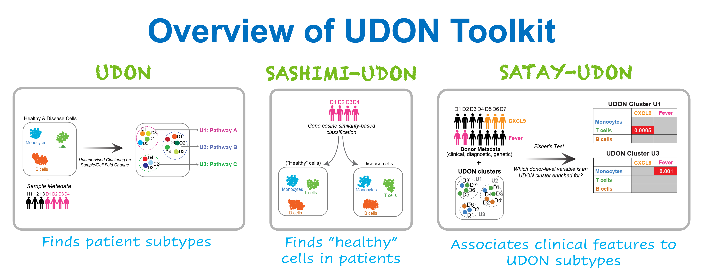

# UDON: Unsupervised Discovery of Novel Disease Programs

**UDON** is a Python package for unsupervised discovery of disease subtypes from patient scRNA-seq data.  
It leverages **control-normalized pseudobulk expression** and **sparse NMF** to identify stable cell-state perturbations.  

UDON includes:  
- **SATAY-UDON** for metadata enrichment  
- **SASHIMI-UDON** for cohorts with limited controls *(coming soon!)*  


---

## 🚀 Installation  

Create a virtual environment and install UDON from PyPI. You can use a conda environment or a venv environment.  
I recommend creating an environment rather than installing pyudon in your base python package because it requires specific versions of certain dependencies. 
I like conda and use the following way to create the environment.

```bash
conda create -n udon_env python=3.10
conda activate udon_env

pip install pyudon
```

## 📂 Input Requirements  

UDON currently supports h5ad format and **human scRNA-seq data**. If your data is in **Seurat**, convert it to `.h5ad` (AnnData) format using either [`SeuratDisk`](https://mojaveazure.github.io/seurat-disk/articles/convert-anndata.html) or [`sceasy`](https://github.com/cellgeni/sceasy). Alternatively, generate an AnnData object directly using **Scanpy**. 

For **non-human datasets**, please reach out by opening a [GitHub issue](https://github.com/kairaveet/py-udon/issues). I’ll help set up the appropriate database for your species.  

1. **Download the database files**  
   - Download the database files attached as zip file [here](https://github.com/kairaveet/py-udon/blob/main/udon-python.zip). 
   - Please unzip the database folder and note the path to the folder and its contents. UDON requires access to this folder when running.  

3. **Ensure input normalization**  
   UDON expects normalized expression values in `adata.X`.  
   - In a **Seurat object**:  
     ```R
     NormalizeData(object)
     ```  
   - In an **Scanpy h5ad**:  
     ```python
     sc.pp.normalize_total(adata, target_sum=1e4)
     sc.pp.log1p(adata)
     ```  

4. **Prepare donor metadata**  
   - UDON requires a donor-level metadata file.  
   - Example: [`donor_metadata.xlsx`](https://github.com/kairaveet/py-udon/blob/main/donor_metadata.xlsx)  
   - Make sure your metadata follows this structure.  

---

## 🛠 Tutorials

The example dataset contains the scRNA-seq datasets of PBMCs from 21 SJIA patients and 5 controls. 
You can download the dataset either from GEO as a set of individual sample h5 files ([GSE207633](https://www.ncbi.nlm.nih.gov/geo/query/acc.cgi?acc=GSE207633)) or a combined and processed h5ad from [here]().

1. **Quickstart**
2. **Full UDON workflow**
3. **Metadata enrichment analysis using SATAY-UDON module**
4. **Determine control-like cells using SASHIMI-UDON module in absence of control data**